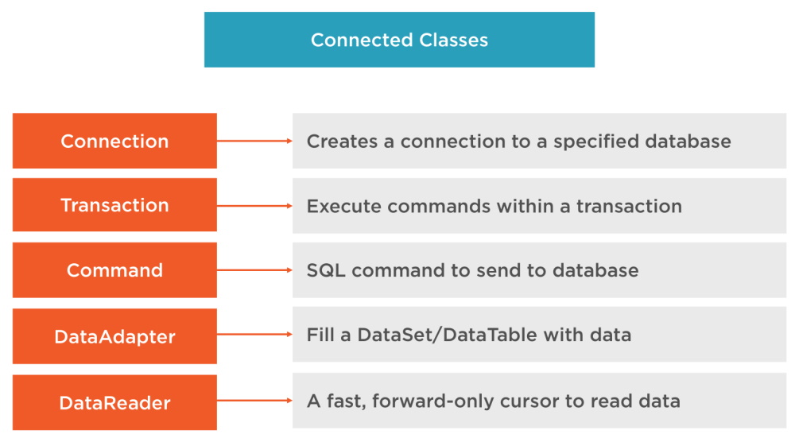
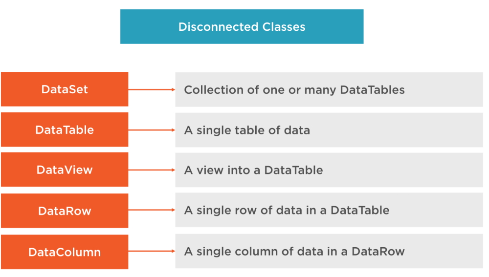
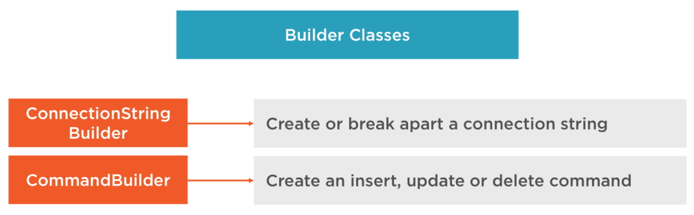
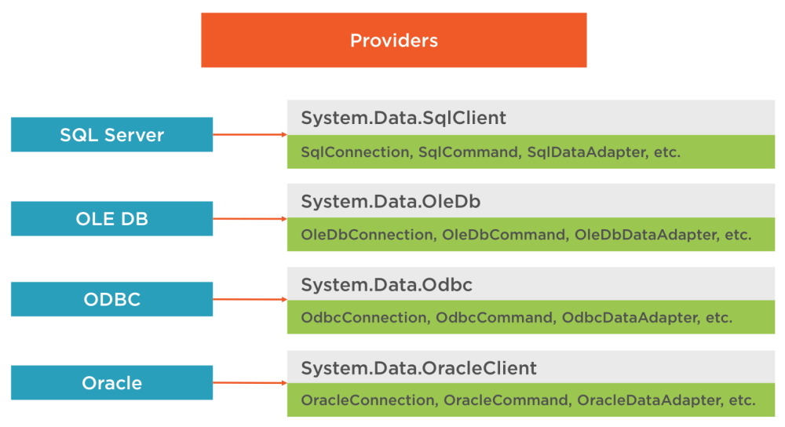
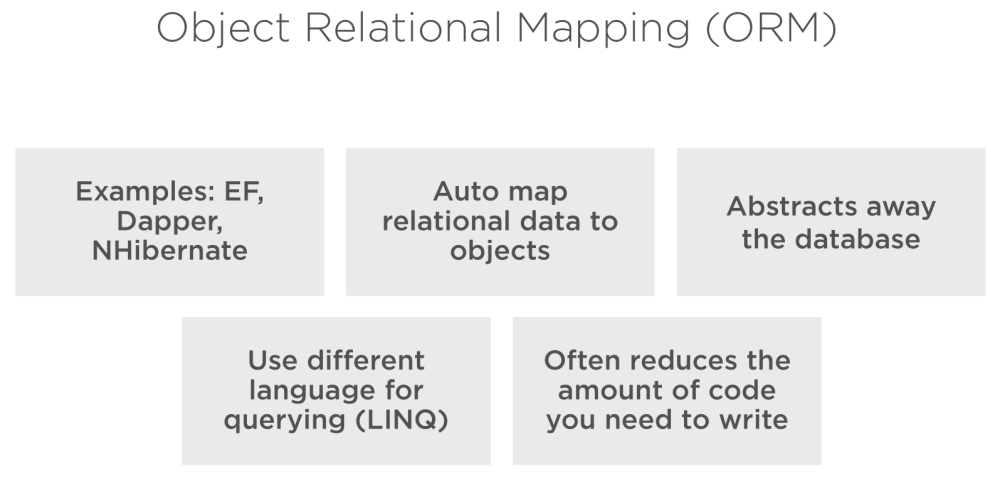

# Why You Still Need to Know ADO.NET

ADO.NET is a set of classes (a framework) to interact with data sources such as databases and XML files. ADO is the acronym for ActiveX Data Objects. It allows us to connect to underlying data or databases. It has classes and methods to retrieve and manipulate data.

The following are a few of the .NET applications that use ADO.NET to connect to a database, execute commands and retrieve data from the database.

> ASP.NET Web Applications      
> Console Applications      
> Windows Applications      

## Various Connection Architectures

There are the following two types of connection architectures:

**1. Connected architecture**: the application remains connected with the database throughout the processing.

### Connection Class

In ADO.NET, we use these connection classes to connect to the database. These connection classes also manage transactions and connection pooling. 

### Command Class

The Command class provides methods for storing and executing SQL statements and Stored Procedures. The following are the various commands that are executed by the Command Class.

**ExecuteReader**: Returns data to the client as rows. This would typically be an SQL select statement or a Stored Procedure that contains one or more select statements. This method returns a DataReader object that can be used to fill a DataTable object or used directly for printing reports and so forth.

**ExecuteNonQuery**: Executes a command that changes the data in the database, such as an update, delete, or insert statement, or a Stored Procedure that contains one or more of these statements. This method returns an integer that is the number of rows affected by the query.

**ExecuteScalar**: This method only returns a single value. This kind of query returns a count of rows or a calculated value.

**ExecuteXMLReader**: (SqlClient classes only) Obtains data from an SQL Server 2000 database using an XML stream. Returns an XML Reader object.

**2. Disconnected architecture**: the application automatically connects/disconnects during the processing. The application uses temporary data on the application side called a DataSet.

### DataReader Class

The DataReader is used to retrieve data. It is used in conjunction with the Command class to execute an SQL Select statement and then access the returned rows. Learn more here: Data Reader in C#.

### DataAdapter Class

The DataAdapter is used to connect DataSets to databases. The DataAdapter is most useful when using data-bound controls in Windows Forms, but it can also be used to provide an easy way to manage the connection between your application and the underlying database tables, views and Stored Procedures.

### DataSet Class

The DataSet is the heart of ADO.NET. The DataSet is essentially a collection of DataTable objects. In turn each object contains a collection of DataColumn and DataRow objects. The DataSet also contains a Relations collection that can be used to define relations among Data Table Objects.

## Builder Classes

## Providers

providers

The only provider that I am interested in is the ``System.Data.SqlClient``.

**Note:** anything that starts with ``Sql`` means that it is used with SQL Server.

## Object Relational Mapping (ORM)

These are systems that automatically map related data to objects. This abstracts away the database so we are using classes instead of data sets or data tables working with a row of data at a time. We use LINQ with ORM's to query that data and this can have issues.

