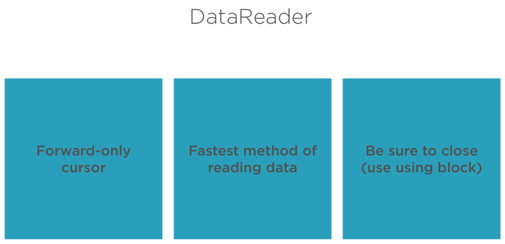
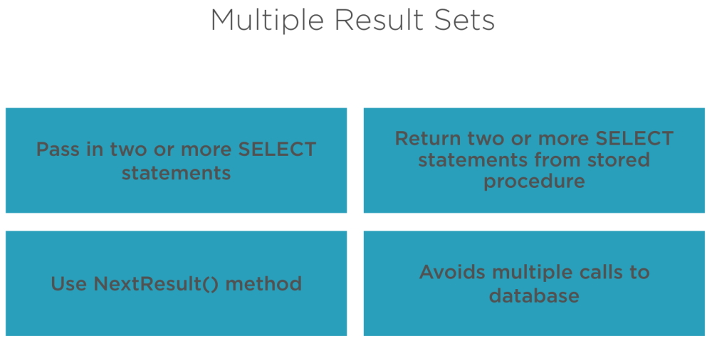

# Retrieve Data Quickly Using the SqlDataReader

The benefits of using a Data Reader to retrieve your data are.



The ADO.NET DataReader object is used for accessing data from the data store and is one of the two mechanisms that ADO.NET provides. The DataReader object provides a read only, forward only, high performance mechanism to retrieve data from a data store as a data stream, while staying connected with the data source. The DataReader is restricted but highly optimized. The .NET framework provides data providers for SQL Server native OLE DB providers and native ODBC drivers,

* SqlDataReader
* OleDbDataReader
* OdbcDataReader

You can use the ADO.NET DataReader to retrieve a read-only, forward-only stream of data from a database. Using the DataReader can increase application performance and reduce system overhead because only one row at a time is ever in memory. After creating an instance of the Command object, you create a DataReader by calling Command.ExecuteReader to retrieve rows from a data source, as shown in the following example.

```
    SqlDataReader myReader = myCommand.ExecuteReader();
```

You use the Read method of the DataReader object to obtain a row from the results of the query. You can access each column of the returned row by passing the name or ordinal reference of the column to the DataReader. However, for best performance, the DataReader provides a series of methods that allow you to access column values in their native data types (GetDateTime, GetDouble, GetGuid, GetInt32, and so on). For a list of typed accessor methods, see the SqlDataReader Class. Using the typed accessor methods when the underlying data type is known will reduce the amount of type conversion required when retrieving the column value.

The following code example iterates through a DataReader object, and returns two columns from each row.

```
    while (myReader.Read())
    {
        Console.WriteLine("\t{0}\t{1}", myReader.GetInt32(0), myReader.GetString(1));
    }
    myReader.Close();  
```

The DataReader provides an unbuffered stream of data that allows procedural logic to efficiently process results from a data source sequentially. The DataReader is a good choice when retrieving large amounts of data because the data is not cached in memory. You should always call the ``Close()`` method when you have finished using the DataReader object. If your Command contains output parameters or return values, they will not be available until the DataReader is closed.

Note that while a DataReader is open, the Connection is in use exclusively by that DataReader. You will not be able to execute any commands for the Connection, including creating another DataReader, until the original DataReader is closed.

## An example of using SQLDataReader

```
    public void GetProductsAsDataReader()
    {
      StringBuilder sb = new StringBuilder(1024);

      // Create a connection
      using (SqlConnection cn = new SqlConnection(AppSettings.ConnectionString)) 
      {
        // Create command object
        using (SqlCommand cmd = new SqlCommand(ProductManager.PRODUCT_SQL, cn))
        {
          // Open the connection
          cn.Open();

          // Execute command to get data reader
          using (SqlDataReader dr = cmd.ExecuteReader(CommandBehavior.CloseConnection))
          {
            while (dr.Read())
            {
              sb.AppendLine("Product: " + dr["ProductId"].ToString());
              sb.AppendLine(dr["ProductName"].ToString());
              sb.AppendLine(Convert.ToDateTime(dr["IntroductionDate"]).ToShortDateString());
              sb.AppendLine(Convert.ToDecimal(dr["Price"]).ToString("c"));
              sb.AppendLine();
            }
          }
        }
      }

      ResultText = sb.ToString();
    }
```

In the method above we are going to create a ``StringBuilder()`` object to store the data retrieved from the data reader as a text list.

``ProductManager.PRODUCT_SQL`` is a constant in the ProductManager class that contains our sql code.

```
    public const string PRODUCT_SQL = "SELECT ProductId, ProductName, IntroductionDate, Url, Price, RetireDate, ProductCategoryId FROM Product";
```

We call our data reader inside a ``using()`` block.

```
    using (SqlDataReader dr = cmd.ExecuteReader(CommandBehavior.CloseConnection))
```

We use the ``.ExecuteReader()`` method to retrieve our data. Once this has completed we need to close the connection and we do this by using the ``CloseConnection`` enumeration. This closes valuable resources.

We open a **cursor** to read the data row by row.

```
    while (dr.Read())
```

We have to convert our data from the data reader into a string format.

```
    sb.AppendLine("Product: " + dr["ProductId"].ToString());
    sb.AppendLine(dr["ProductName"].ToString());
    sb.AppendLine(Convert.ToDateTime(dr["IntroductionDate"]).ToShortDateString());
    sb.AppendLine(Convert.ToDecimal(dr["Price"]).ToString("c"));
    sb.AppendLine();
```

This will convert each column object in the data row into a line of text.

**Note:** this process would fail if any of the fields had a **null** value. If you look at the table in the database all columns are ``NOT NULL`` so it works in this case. In the real world we would have to allow for nulls and we will do this later.

The connection is closed because of the ``CommandBehavior.CloseConnection``.

## The DataReader Methods GetOrdinal GetInt32 and Others

We are responsible for casting the data that comes out of the DataReader. Each column has a different data type and we need to know what that is. There are a couple of ways that we can do this.

There is a ``GetOrdinal(string)`` that returns an **integer**. The string value is the name of the column and it returns the column position. Why do we need this? We need it because there are a number of other methods that only work with the integer position number. These methods are

* ``GetInt32(integer)``
* ``GetString(integer)``
* ``GetDateTime(integer)``

These require the column position in the DataReaderand we combine these with the ``GetOrdinal(string)`` to retrieve that data.

The other thing we didn't take into account were **nulls** so we use the ``IsDBNull(integer)`` method to find out if a columns field is either a value or a null. 
 
Using the ``GetOrdinal()`` and ``Get()`` methods we can build a generic list of objects.

## Perform conversions for a generic list

First we create a List<T> collection of Products from the data reader.

```
  /// <summary>
  /// Get/Set Products collection
  /// </summary>
  public List<Product> Products
  {
      get { return _Products; }
    set {
        _Products = value;
    }
  }
```

We can look at the Product class in our code.

```
  public class Product : CommonBase
  {
    public int ProductId { get; set; }
    public string ProductName { get; set; }
    public DateTime IntroductionDate { get; set; }
    public string Url { get; set; }
    public decimal Price { get; set; }
    public DateTime? RetireDate { get; set; }
    public int? ProductCategoryId { get; set; }
  }
```

The interesting fields in the Product class are the RetireDate and ProductCategoryId fields. These are set up as **nullable** fields and this is how they are stored in the database.

In the following code we clear any list of Products that is hanging around so we can create a new list of Product objects.

After we open a Sql connection and return a SqlDataReader of Product objects. We iterate through the objects creating a new ``Products.Add()`` method to create a new Product from the field values, one for each record in our DataReader. The main aim here is to convert the values coming from the SqlDataReader into the data types that match our Product class.

```
  public List<Product> GetProductsAsGenericList()
  {
    Products.Clear();

    // Create a connection
    using (SqlConnection cn = new SqlConnection(AppSettings.ConnectionString))
    {
      // Create command object
      using (SqlCommand cmd = new SqlCommand(ProductManager.PRODUCT_SQL, cn))
      {
        // Open the connection
        cn.Open()  
        
        // Execute command to get data reader
        using (SqlDataReader dr = cmd.ExecuteReader(CommandBehavior.CloseConnection))
        {
          while (dr.Read())
          {
            Products.Add(new Product
            {
              ProductId = dr.GetInt32(dr.GetOrdinal("ProductId")),
              ProductName = dr.GetString(dr.GetOrdinal("ProductName")),
              IntroductionDate = dr.GetDateTime(dr.GetOrdinal("IntroductionDate")),
              Url = dr.GetString(dr.GetOrdinal("Url")),
              Price = dr.GetDecimal(dr.GetOrdinal("Price")),                
              // Check for Null
              RetireDate = dr.IsDBNull(dr.GetOrdinal("RetireDate"))
                                ? (DateTime?)null
                                : Convert.ToDateTime(dr["RetireDate"]),
              ProductCategoryId = dr.IsDBNull(dr.GetOrdinal("ProductCategoryId"))
                                       ? (int?)null
                                       : Convert.ToInt32(dr["ProductCategoryId"]),
            });
          }
        }
      }

    return Products;
  }
```

We need to know what field types we are using for each column.

If the column returns an integer value we can.

```
  ProductId = dr.GetInt32(dr.GetOrdinal("ProductId"))
```

This will return a *ProductId* which is an integer.

If the column field is a string we will use the following code to return a string.

```
  ProductName = dr.GetString(dr.GetOrdinal("ProductName"))
```

For a Decimal field.

```
  Price = dr.GetDecimal(dr.GetOrdinal("Price"))
```

For a DateTime field.

```
  IntroductionDate = dr.GetDateTime(dr.GetOrdinal("IntroductionDate"))
```

If a field in the database is nullable we have to do a bit more work.

```
  RetireDate = dr.IsDBNull(dr.GetOrdinal("RetireDate"))
                            ? (DateTime?)null : Convert.ToDateTime(dr["RetireDate"]),
  ProductCategoryId = dr.IsDBNull(dr.GetOrdinal("ProductCategoryId"))
                            ? (int?)null : Convert.ToInt32(dr["ProductCategoryId"])
```

We are using the ``dr.IsDBNull()`` method to return either a null of that data type or return the value in the field.

At the end of this we end up with our Products collection that we bind to our UI.

## GetFieldValue() generic method

Using each of the ``Get()`` methods is the old way of doing things. There is a ``GetFieldValue<>()`` where you pass in a data type and it will do the conversion for you to that specific data type. You still have to call ``GetOrdinal()`` because ``GetFieldvalue<>()`` does take a position and it does not handle nullable fields like the previous ``Get()`` methods we saw previously.

```
  public ObservableCollection<Product> GetProductsUsingFieldValue()
  {
    Products.Clear();
    
    // Create a connection
    using (SqlConnection cn = new SqlConnection(AppSettings.ConnectionString))
    {
      // Create command object
      using (SqlCommand cmd = new SqlCommand(ProductManager.PRODUCT_SQL, cn))
      {
        // Open the connection
        cn.Open();

        // Execute command to get data reader
        using (SqlDataReader dr = cmd.ExecuteReader(CommandBehavior.CloseConnection))
        {
          while (dr.Read())
          {
            Products.Add(new Product
            {
              ProductId = dr.GetFieldValue<int>(dr.GetOrdinal("ProductId")),
              ProductName = dr.GetFieldValue<string>(dr.GetOrdinal("ProductName")),
              IntroductionDate = dr.GetFieldValue<DateTime>(dr.GetOrdinal("IntroductionDate")),
              Url = dr.GetFieldValue<string>(dr.GetOrdinal("Url")),
              Price = dr.GetFieldValue<decimal>(dr.GetOrdinal("Price")),
              
              // NOTE: GetFieldValue() does not work on nullable fields
              RetireDate = dr.IsDBNull(dr.GetOrdinal("RetireDate"))
                              ? (DateTime?)null : Convert.ToDateTime(dr["RetireDate"]),
              ProductCategoryId = dr.IsDBNull(dr.GetOrdinal("ProductCategoryId"))
                              ? (int?)null : Convert.ToInt32(dr["ProductCategoryId"])
            });
          }
        }
      }
    }
    return Products;
  }
```

Once again you still have to know your field types, for example.

```
  ProductId = dr.GetFieldValue<int>(dr.GetOrdinal("ProductId"))
```

You pass the data type into GetFieldValue<int>(GetOrdinal("ProductId")). You still have to pass in the ``GetOrdinal()`` method because ``GetFieldValue()`` needs the column position.

**Note:** as we said previously ``GetFieldValue()`` doesn't work on nullable data types.

## Create extension method

We are going to build an extension method to improve our code readability.

It is the GetFieldValue<T>(string) method and this will allow us to pass in a string value that is the column name and this will be able to handle the nullable fields. We can simplify all of the code from our previous examples by using this extension method.

```
  public ObservableCollection<Product> GetProductsUsingExtensionMethods()
  {
    Products.Clear()  
  
    // Create a connection
    using (SqlConnection cn = new SqlConnection(AppSettings.ConnectionString))
    {
      // Create command object
      using (SqlCommand cmd = new SqlCommand(ProductManager.PRODUCT_SQL, cn))
      {
        // Open the connection
        cn.Open()  
      
        // Execute command to get data reader
        using (SqlDataReader dr = cmd.ExecuteReader(CommandBehavior.CloseConnection))
        {
          while (dr.Read())
          {
            Products.Add(new Product
            {
              // Use custom extension method
              ProductId = dr.GetFieldValue<int>("ProductId"),
              ProductName = dr.GetFieldValue<string>("ProductName"),
              IntroductionDate = dr.GetFieldValue<DateTime>("IntroductionDate"),
              Url = dr.GetFieldValue<string>("Url"),
              Price = dr.GetFieldValue<decimal>("Price"),
              RetireDate = dr.GetFieldValue<DateTime?>("RetireDate"),
              ProductCategoryId = dr.GetFieldValue<int?>("ProductCategoryId")
            });
          }
        }
      }

    return Products;
  }
```

The code above is more concise than previous examples. Notice the code in the nullable field types.

```
  RetireDate = dr.GetFieldValue<DateTime?>("RetireDate"),
  ProductCategoryId = dr.GetFieldValue<int?>("ProductCategoryId")
```

The Extension method is

```
  public static class DataReaderHelpers
  {
    public static T GetFieldValue<T>(this SqlDataReader dr, string name)
    {
      T value = default;

      if (!dr[name].Equals(DBNull.Value)) {
        value = (T)dr[name];
      }

      return value;
    }
  }
```

We start by making the data type of the field a nullable data type.

```
  T value = default;
```

We can then check for a field value and if it exists we can get and return the value.

```
  if (!dr[name].Equals(DBNull.Value)) {
    value = (T)dr[name];
  }

  return value;
```

In the end we return a null of the data type or the value of the data type and that value becomes the data for that property in the Product object.

## Multiple result sets



You can pass in two or more select statements and this avoids multiple calls to the database.

```
  public void GetMultipleResultSets()
  {
    Products.Clear();
    Categories.Clear()

    // Create SQL statement to submit
    string sql = ProductManager.PRODUCT_SQL;
    sql += ";" + ProductManager.PRODUCT_CATEGORY_SQL  
    
    // Create a connection
    using (SqlConnection cn = new SqlConnection(AppSettings.ConnectionString))
    {
      // Create command object
      using (SqlCommand cmd = new SqlCommand(sql, cn))
      {
        // Open the connection
        cn.Open()  
      
        // Execute command to get data reader
        using (SqlDataReader dr = cmd.ExecuteReader(CommandBehavior.CloseConnection))
        {
          while (dr.Read())
          {
            Products.Add(new Product
            {
              ProductId = dr.GetFieldValue<int>("ProductId"),
              ProductName = dr.GetFieldValue<string>("ProductName"),
              IntroductionDate = dr.GetFieldValue<DateTime>("IntroductionDate"),
              Url = dr.GetFieldValue<string>("Url"),
              Price = dr.GetFieldValue<decimal>("Price"),
              RetireDate = dr.GetFieldValue<DateTime?>("RetireDate"),
              ProductCategoryId = dr.GetFieldValue<int?>("ProductCategoryId")
            });

          // Move to next result set
          dr.NextResult() 
          
          // Read next result set
          while (dr.Read())
          {
            Categories.Add(new ProductCategory
            {
              ProductCategoryId = dr.GetFieldValue<int>("ProductCategoryId"),
              CategoryName = dr.GetFieldValue<string>("CategoryName")
            });
          }
        }
      }
    }
  }
```

In this code we are going to return the Products collection and the Categories collection.

We process the Products collection and when we finish we move the data reader to the next result set.

```
  // Move to next result set
  dr.NextResult() 
```

Now we process the ProductCategories into the Categories collection.

Once we have completed this we can bind the collections to different Gridviews or WPF grids.
