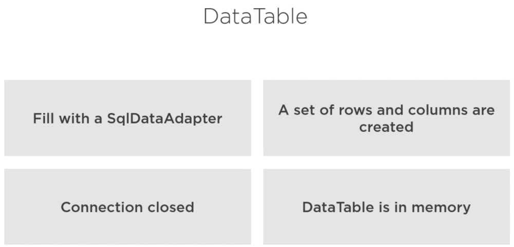

# Disconnected Classes Are Useful

## What are disconnected classes?

ADO.NET disconnected classes are the basic building blocks of the ADO .NET architecture. These classes are loosely coupled with data providers. The System.Data namespace defines these classes.

### The System.Data Namespace

The System.Data namespace consists of classes that are the basic building block of the ADO.NET architecture. These classes are also known as disconnected classes because they store disconnected data and can work without data providers.

We use Data Tables and Data Sets to work with this disconnected data.

### Loading a Data Table using a Sql Adapter



The upshot of this process is that we close our connection (release our resources) once we have filled our data table and now we can work with our data in memory.

The following code shows loading a data table and then looping through the rows and columns.

```
    public DataTable GetProductsAsDataTable()
    {
      // Initialize DataTable object to null in case of an error
      DataTable dt = null;

      // Create a connection
      using (SqlConnection cn = new SqlConnection(AppSettings.ConnectionString))
      {
        // Create command object
        using (SqlCommand cmd = new SqlCommand(ProductManager.PRODUCT_SQL, cn)) 
        {
          // Create a SQL Data Adapter
          using (SqlDataAdapter da = new SqlDataAdapter(cmd))
          {
            // Create new DataTable object for filling
            dt = new DataTable();

            // Fill DataTable using Data Adapter
            da.Fill(dt);
          }
        }
      }

      // Loop through all rows/columns
      ProcessRowsAndColumns(dt);

      return dt;
    }
```

Once we have filled the data table we would close the connection and then start working with the data table. In our case we have a method to work with the data.

### ProcessRowsAndColumns

```
    private void ProcessRowsAndColumns(DataTable dt)
    {
      StringBuilder sb = new StringBuilder(2048);
      int index = 1;

      // Process each row
      foreach (DataRow row in dt.Rows)
      {
        sb.AppendLine("** Row: " + index.ToString() + " **");
        // Process each column
        foreach (DataColumn col in dt.Columns) 
        {
          sb.AppendLine(col.ColumnName + ": " + row[col.ColumnName].ToString());
        }
        
        sb.AppendLine();

        index++;
      }

      ResultText = sb.ToString();
    }
```

We process the data into a StringBuilder object and then return the text. This just gives us a text view of our data but you could load it into a gridview or dropdown list.

### Create a Generic List of Products from a DataTable

We have created a generic list of objects before but now we are going to use a Data Table to hold our objects. To be able to do this we have to convert the table to an enumerable list. Once we have that enumerable list we are going to use the generic ``Field<T>`` method and this does handle nullable fields.

#### GetProductsAsGenericList

```
  public List<Product> GetProductsAsGenericList()
  {
    List<Product> products = new List<Product>();
    ResultText = string.Empty;
    RowsAffected = 0;

    // Initialize DataTable object to null in case of an error
    DataTable dt = null;

    // Create SQL statement to submit
    string sql = ProductManager.PRODUCT_SQL;
    sql += " WHERE ProductName LIKE @ProductName";

    // Create a connection
    using (SqlConnection cn = new SqlConnection(AppSettings.ConnectionString))
    {
      // Create command object
      using (SqlCommand cmd = new SqlCommand(sql, cn))
      {
        // Create parameter
        cmd.Parameters.Add(new SqlParameter("@ProductName", SearchEntity.ProductName));

        // Create a SQL Data Adapter
        using (SqlDataAdapter da = new SqlDataAdapter(cmd))
        {
          // Fill DataTable using Data Adapter
          dt = new DataTable();
          da.Fill(dt);
          if (dt.Rows.Count > 0)
          {
            products =
              (from row in dt.AsEnumerable()  // Must convert to an enumerable object
               select new Product
               {
                 // Use Field<T>() method to get data
                 ProductId = row.Field<int>("ProductId"),
                 ProductName = row.Field<string>("ProductName"),
                 IntroductionDate = row.Field<DateTime>("IntroductionDate"),
                 Url = row.Field<string>("Url"),
                 Price = row.Field<decimal>("Price"),
                 // The Field<T>() method works with nullable types
                 RetireDate = row.Field<DateTime?>("RetireDate"),
                 ProductCategoryId = row.Field<int?>("ProductCategoryId")
               }).ToList();
          }
        }
      }
    }

    return products;
  }
```

Where ``ProductManager.PRODUCT_SQL`` is a constant string containing the select statement.

```
  public const string PRODUCT_SQL = "SELECT ProductId, ProductName, IntroductionDate, Url, Price, RetireDate, ProductCategoryId FROM Product";
```

We add a ``where`` clause to create a smaller result set.

``SearchEntity.ProductName`` contains the value **WPF%** so we are searching for values that contain the product name WPF.

We create a Sql Data Adapter and fill the Data Table using the Sql Data Adapter. We then make sure the Data Table has some data with the statement ``dt.Rows.Count > 0``. We then make the Data Table enumerable with the ``dt.AsEnumerable()`` method that converts the data into an enumerable list.

We convert the rows in the enumerable list into the Product objects properties using the Field<T> method to get the data.

```
  select new Product
     {
       ProductId = row.Field<int>("ProductId"),
```

With the nullable fields we have the following format to allow for null values.

```
  RetireDate = row.Field<DateTime?>("RetireDate"),
  ProductCategoryId = row.Field<int?>("ProductCategoryId")
```

The last thing we do is convert it to a list.

```
  ).ToList();
```

Now if you look at our products list you will see that we have three values. we can now display these values however we want either using WPF or a web view.

We have seen how easy it is to take a Data Table and create an enumerable list but what happens if you have more than one Data Table or multiple result sets? We saw how to do this with a DataReader but we can also do this with a DataSet.

### DataSet

A **DataSet** is a collection of Data Table objects that are kept in memory. We use multiple SELECT statements to create multiple Data Table objects. This is done automatically using a DatSet.

```
    public void GetMultipleResultSets()
    {
      ResultText = string.Empty;
      RowsAffected = 0;
      DataSet ds = new DataSet();

      // Create SQL statement to submit
      string sql = ProductManager.PRODUCT_SQL;
      sql += ";" + ProductManager.PRODUCT_CATEGORY_SQL;

      // Create a connection
      using (SqlConnection cn = new SqlConnection(AppSettings.ConnectionString))
      {
        // Create command object
        using (SqlCommand cmd = new SqlCommand(sql, cn))
        {
          // Create a SQL Data Adapter
          using (SqlDataAdapter da = new SqlDataAdapter(cmd))
          {
            // Fill DataSet using Data Adapter            
            da.Fill(ds);

            if (ds.Tables.Count > 0)
            {
              Products = ds.Tables[0];
              Categories = ds.Tables[1];
            }
          }
        }
      }
    }
```

We create a new DatSet.

```
  DataSet ds = new DataSet();
```

Then we create our multiple SELECT statements. Each SELECT statement is separated by a semi colon.

```
  string sql = ProductManager.PRODUCT_SQL;
  sql += ";" + ProductManager.PRODUCT_CATEGORY_SQL;
```

We are grabbing rows from the Product and ProductCategory tables. We then do our standard connection, command and Sql Data Adapter commands. Now we fill our Sql Data Adapter.

```
  da.Fill(ds);
```

Now if we have table data in the data adapter we can load the data into the DataSets.

```
  if (ds.Tables.Count > 0)
  {
    Products = ds.Tables[0];
    Categories = ds.Tables[1];
  }
```

The order that the tables are created are the same as the order in the SELECT statements.

The Products and Categories Data Tables are created as properties.

```
  #region Public Properties
  /// <summary>
  /// Get/Set Products collection
  /// </summary>
  public DataTable Products
  {
    get { return _Products; }
    set {
      _Products = value;
    }

  /// <summary>
  /// Get/Set Category collection
  /// </summary>
  public DataTable Categories
  {
    get { return _Categories; }
    set {
      _Categories = value;
    }
  }
```

### DataView Class

We have seen Data Tables and DataSets and there is one more in memory construct that we can use and that is the DataView.

A DataView is a bindable view of a Data Table. Sometimes you want to bind data up to a grid and you can't do that with a Data Table out of a box but with a DataView you can and there is a property on a Data Table that can convert a Data Table to a DataView. There are other uses for a DataView as well. For example there is a ``Sort`` property to sort the data. There is a ``RowFilter`` property that we can use to filter the data. The nice thing is that once we have that data in memory we can sort and filter in memory and we don't have to go back to the database. We can also edit that data in memory and then choose to return that data back to the database later.

### Sorting data in a DataView

```
    public DataView GetProductsSortedByPriceDescending()
    {
      ProductManager mgr = new ProductManager();
      DataView dv = null;

      // Get Products as a DataTable
      DataTable dt = mgr.GetProductsAsDataTable();
      if (dt != null)
      {
        // Set DataView
        dv = dt.DefaultView;

        // Sort the data
        dv.Sort = "IntroductionDate DESC, Price DESC";

        // Set RowsAffected
        RowsAffected = dv.Count;

        // Set ResultText
        ResultText = "Rows: " + RowsAffected.ToString();
      }

      return dv;
    }
```

The ``ProductManager()`` method loads the Products into a Data Table. 

```
  DataTable dt = mgr.GetProductsAsDataTable();
```

We can now load the Data Table into the DataView using the following command.

```
  dv = dt.DefaultView;
```

Next we can set up the ``Sort()`` statement and using a comma we can sort by multiple fields.

```
  dv.Sort = "IntroductionDate DESC, Price DESC";
```

The next example is using the ``RowFilter()`` method to filter the number of records being returned from memory.

```
    public DataView GetProductsPriceLessThan(decimal lessThan)
    {
      ProductManager mgr = new ProductManager();
      DataView dv = null;

      // Get Products as a DataTable
      DataTable dt = mgr.GetProductsAsDataTable();

      if (dt != null)
      {
        // Set DataView
        dv = dt.DefaultView;

        // Filter the Data
        dv.RowFilter = "Price < " + lessThan.ToString();

        // Can filter using And, Or, True, False, Is, Like, etc.
        //dv.RowFilter = "Price < " + lessThan.ToString() + " AND ProductCategoryId = 1";

        // Set RowsAffected
        RowsAffected = dv.Count;

        // Set ResultText
        ResultText = "Rows: " + RowsAffected.ToString();
      }

      return dv;
    }
```

### Create a DataView using a LINQ statement

We can also use LINQ to filter records. We have our Data Table and we can use LINQ to query the Data Table and return the records to the DataView.

```
    public DataView GetProductsPriceLessThanLINQ(decimal lessThan)
    {
      ProductManager mgr = new ProductManager();
      DataView dv = null;

      // Get Products as a DataTable
      DataTable dt = mgr.GetProductsAsDataTable();

      if (dt != null)
      {
        dv = (from prod in dt.AsEnumerable()
          where prod.Field<decimal>("Price") < lessThan
          orderby prod.Field<decimal>("Price")
          select prod).AsDataView();

        // Set RowsAffected
        RowsAffected = dv.Count;

        // Set ResultText
        ResultText = "Rows: " + RowsAffected.ToString();
      }

      return dv;
    }
```

If the Data Table has records we can interrogate the Data Table with our LINQ query.

```
  dv = (from prod in dt.AsEnumerable()
    where prod.Field<decimal>("Price") < lessThan
    orderby prod.Field<decimal>("Price")
    select prod).AsDataView();
```

We use the ``AsDataView()`` method to return the filtered Data Table records back to the DataView.

We can use ``Sort()`` and ``RowFilter()`` or use LINQ to return data to the DataView. The choice is yours.

### Convert a DataView Back to a DataTable

If you apply a sort or a row filter to your DataView you can also return that data to a Data Table.

```
    public DataTable DataViewToDataTable()
    {
      ProductManager mgr = new ProductManager();
      DataView dv = null;
      DataTable dtFiltered = null;
      
      // Get Products as a DataTable
      DataTable dt = mgr.GetProductsAsDataTable();

      if (dt != null)
      {
        // Build a DataView
        dv = (from prod in dt.AsEnumerable()
              where prod.Field<decimal>("Price") < 29
              orderby prod.Field<decimal>("Price") descending
              select prod).AsDataView();

        // Set RowsAffected
        RowsAffected = dv.Count;

        // Convert back to DataTble
        dtFiltered = dv.ToTable();

        // Set ResultText
        ResultText = "Rows: " + RowsAffected.ToString();
      }

      return dtFiltered;
    }
```

In the code above we are creating a new Data Table named **dtFiltered** to contain the records that were sorted and filtered in the DataView.

```
  dtFiltered = dv.ToTable();
```

We use the ``ToTable()`` method to return the DataView data to the new Data Table (dtFiltered).
